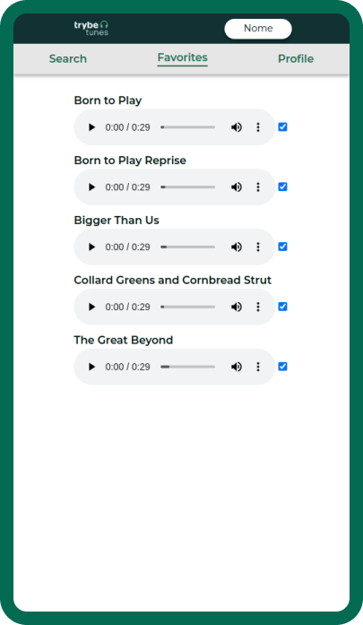

# Welcome to TrybeTunes project!
This is a [Trybe](https://www.betrybe.com/) project developed as part of the Frontend Module to exercise and consolidate the basics of React.

---

# Summary
- [Welcome to TrybeTunes project!](#welcome-to-trybetunes-project!)
- [Note](#note)
- [Summary](#summary)
- [Context](#context)
- [Technologies Used](#technologies-used)
- [Lint](#lint)
- [Preview](#preview)

---

# Note
At this point of the course, the classes of React Testing Library and Fetch Simulators still haven't been teached, so the whole treatment of API requests and tests were pre-developed by Trybe's team.

---

# Context
This project is a __Music Web App__ that allows the user to:
 * __Search__ for an artist or album
 * __View__ the songs of an specific album
 * __Like or dislike__ a song and access the list of favorite songs
 * __Edit__ the user's profile info

---

# Technologies Used
This project used the following technologies and features:
  * __React__ | React Router, [React Lifecycle](https://projects.wojtekmaj.pl/react-lifecycle-methods-diagram/), [State and Props](https://reactjs.org/docs/thinking-in-react.html), [CSS Modules](https://www.w3schools.com/react/react_css.asp)
  * __ES6__ | Spread Operator, Destructuring, HOFs
  * __CSS3__ | Mobile First, Responsive Web Design, Flexbox, [CSS Reset](https://www.digitalocean.com/community/tutorials/css-minimal-css-reset), [BEM](https://medium.com/trabe/a-more-javascript-friendly-bem-naming-convention-75c7f01ff736)

---

# Lint
The project was developed following the Clean Code standards specified by Trybe's Lint rules.

For installation and more information [click here](https://github.com/betrybe/eslint-config-trybe).

---

# Preview
| Login | Search | Album |
| --- | --- | --- |
|  |  |  |

| Favorites | Profile | Profile Edit |
| --- | --- | --- |
|  |  |  |